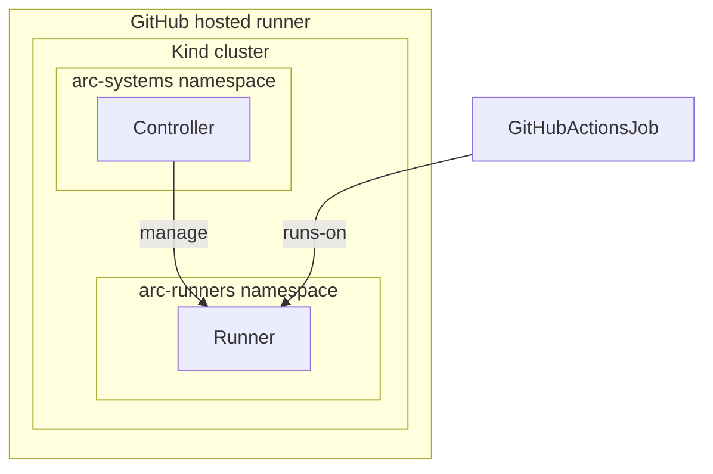

# actions-runner-controller-in-actions 

This repository contains an E2E test to run [actions/actions-runner-controller](https://github.com/actions/actions-runner-controller) and [`RunnerScaleSet`](https://docs.github.com/en/actions/hosting-your-own-runners/managing-self-hosted-runners-with-actions-runner-controller/deploying-runner-scale-sets-with-actions-runner-controller) in GitHub Actions.

## How it works

It deploys the following stack in GitHub Actions:

- Kind
- Helmfile
- Actions Runner Controller (ARC)
- Runner scale sets

Here is the diagram.

